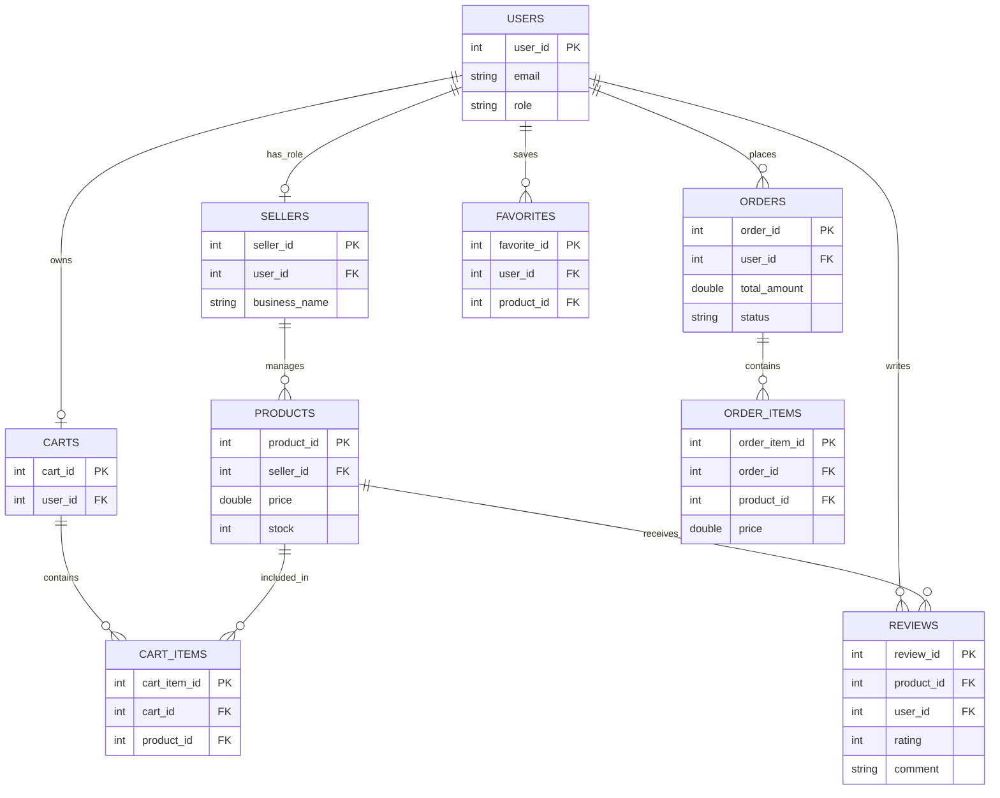

# 🛒 RevShop - Console-Based E-Commerce Application

RevShop is a console-based e-commerce application built using **Java and JDBC** with Oracle Database integration.  
It supports distinct workflows for **Buyers** and **Sellers**, simulating real-world online shopping operations.

---

## 🚀 Technology Stack

- **Language**: Java (JDK 8+)
- **Database**: Oracle Database (JDBC)
- **Logging**: Java Util Logging (Custom LoggerUtil)

---

## ⚙️ Setup Instructions

1. **Database**: Execute the provided SQL scripts (ERD based) to set up tables  
   (`users`, `products`, `orders`, `carts`, `sellers`, etc.).

2. **Configuration**: Update  
   `src/com/revshop/util/JDBCUtil.java`  
   with your database credentials.

3. **Compile**:
   ```bash
   javac -d bin -sourcepath src src/com/revshop/main/Main.java
   ```

4. **Run**:
   ```bash
   java -cp bin com.revshop.main.Main
   ```

---

## 👤 Usage Flow

### 🧾 Registration
- Users can register as **Buyer** or **Seller**
- Sellers must provide business details

### 🛍 Buyer Flow
- Browse products
- Search by category
- Add to cart (modify quantity)
- Manage favorites
- Checkout (place order)
- Write reviews

### 🏪 Seller Flow
- Add products
- View inventory
- Update stock

---

## 🗄 Database Design (ER Diagram)



---

## 🏗 Architecture Overview

- Layered structure (DAO, Service, Util, Main)
- JDBC-based data access layer
- Custom logging utility
- Relational database design
- Role-based workflow separation

---

**Updated by Nikhitha**
